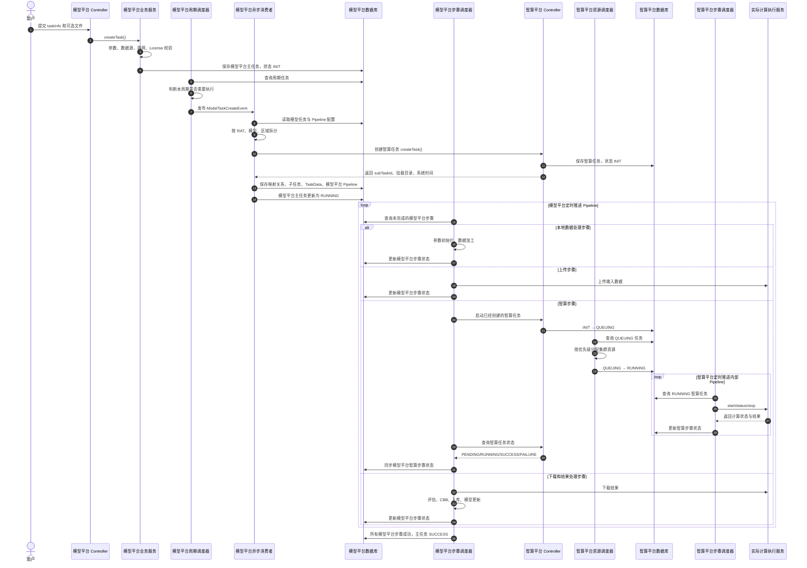

# 模型平台与智算平台全流程说明

> `推训流程.md` 描述模型平台，`study1.md` 描述智算平台。二者不是同一平台的两个触发入口，而是一条跨平台的上下游调用链。

## 一、整体定位

这套系统可以理解为两级调度、三级执行：

```text
模型平台
    ↓ 创建、启动、查询智算任务
智算平台 SmartScheduler
    ↓ 启动、查询、停止实际计算任务
实际计算执行服务 / AI PDU / Manas
    ↓
训练、推理、评估程序
```

其中：

- 模型平台是上层业务编排系统。
- 智算平台是下层计算调度系统。
- 实际计算执行服务负责运行训练、推理和评估程序。

模型平台在执行自己的 Pipeline 时，会在中间的“智算执行步骤”中调用智算平台。智算平台收到任务后，再进行排队、资源分配和内部计算流程调度。

## 二、两个平台的职责边界

| 平台 | 核心职责 | 不负责的内容 |
|---|---|---|
| 模型平台 | 接收业务任务、校验数据、拆分 RAT/模型/区域、加工数据、上传下载、调用智算、处理结果、管理模型生命周期 | 不直接分配 GPU，也不直接运行模型训练进程 |
| 智算平台 | 接收模型平台创建的计算任务、排队、分配集群资源、启动训练/推理、查询执行状态、停止任务 | 不负责完整的业务数据准备和最终业务结果入库 |
| 实际计算执行服务 | 真正运行训练、推理、评估、CBB 等程序 | 不负责上层业务任务编排 |

两个平台中都可能出现 `TaskInfo`、`SecondScheduler`、Pipeline、定时调度器等类似名称，但它们属于不同的平台：

- 模型平台 Pipeline 是业务处理流水线。
- 智算平台 Pipeline 是计算执行流水线。
- 模型平台 `SecondScheduler` 管理数据加工、上传、智算执行、下载和后处理。
- 智算平台 `SecondScheduler` 管理训练、推理、CBB、T0、解释等具体计算步骤。

即使类名相同，也不能把它们当成同一份任务记录或同一个调度器。

## 三、跨平台完整时序



## 四、阶段一：模型平台接收任务

模型平台入口：

```text
POST /task/v1/task-add
Content-Type: multipart/form-data
```

请求通常包含：

- `taskInfo`：描述任务类型、模型、RAT、Polygon、数据时间范围等信息的 JSON 字符串。
- `file`：可选的标注文件或辅助数据文件。

模型平台 `TaskOperatorController.addTask()` 负责：

1. 将 `taskInfo` 解析为模型平台的 `TaskInfo`。
2. 从请求头获取当前用户，设置 `creator`。
3. 根据配置设置 `storeLoc`。
4. 设置默认方案类型 `solutionType=STANDARD`。
5. 执行接口参数校验。
6. 调用 `TaskOperatorService.createTask()`。

这里创建的是模型平台业务任务，并不是智算任务。

## 五、阶段二：模型平台校验并保存主任务

模型平台首先生成自己的 `taskId`，然后通过 `TaskCheckChain` 执行业务校验。

| 校验策略 | 检查内容 |
|---|---|
| `DataResourceCheckStrategy` | 数据源是否可用、Polygon 覆盖的小区或基站是否合理 |
| `MapRoadGridCheckStrategy` | 路网和网格配置是否合法，是否存在冲突 |
| `LicenseCheckStrategy` | License 配额、场景和容量是否满足要求 |

校验通过后：

1. 可选文件保存到 HDFS 或共享磁盘。
2. 模型平台主任务写入模型平台数据库。
3. 模型平台任务状态初始化为 `INIT`。

此时：

- 智算平台还没有对应任务。
- 模型平台也还没有真正执行 Pipeline。

## 六、阶段三：模型平台周期调度触发任务

模型平台任务创建完成后，由 `PeriodTaskExecutor.schedule()` 周期检查是否应当开始本轮执行：

1. 查询已经配置的周期任务。
2. 读取模型平台主任务信息。
3. 根据执行模式、时间窗口和容量判断本周期是否需要执行。
4. 通过匹配的 `IPeriodTask` 计算本轮数据开始时间和结束时间。
5. 如果需要执行，发布 `ModelTaskCreateEvent`。

完整关系是：

```text
用户创建模型平台任务
    ↓
模型平台保存为 INIT
    ↓
PeriodTaskExecutor 判断执行周期
    ↓
发布 ModelTaskCreateEvent
    ↓
异步创建本轮实际执行任务
```

创建接口本身并不立即启动整个推训流程。

## 七、阶段四：模型平台异步生成任务

`ModelTaskCreateConsumer` 监听 `ModelTaskCreateEvent`，并在线程池 `model-sync` 中异步执行。

主要处理过程：

1. 查询模型平台主任务。
2. 设置本轮数据开始时间和结束时间。
3. 根据模型名称读取 `TaskPipeline-{modelName}.json`。
4. 创建 `TaskGenerationStrategyChain`。
5. 按 RAT、模型和区域等维度拆分任务。
6. 为需要计算的组合调用智算平台创建任务。
7. 在模型平台数据库中建立业务 Pipeline。
8. 将模型平台主任务更新为 `RUNNING`。

模型平台的任务层次大致为：

```text
模型平台 TaskInfo
└── 模型平台 SubTaskInfo
    ├── RAT，例如 NR、LTE
    ├── 模型，例如 UEM、BSLM
    ├── Polygon 或小区批次
    └── 模型平台 SecondScheduler
        ├── 数据加工
        ├── 上传
        ├── 智算执行
        ├── 下载
        └── 结果处理
```

## 八、阶段五：模型平台调用智算平台创建任务

模型平台在 `PipelineStrategy.createSubTask()` 中调用：

```text
createIntelligentTask()
```

请求大致包含：

```json
{
  "taskId": "模型平台任务ID",
  "taskType": "training/prediction/evaluation",
  "storeLoc": "存储位置",
  "polygonName": "区域名称",
  "cellCount": "小区数量",
  "rat": "NR/LTE",
  "osType": "操作系统类型",
  "model": "模型配置"
}
```

### 智算平台创建阶段的操作

智算平台接到请求后执行 `createTask()`：

1. 校验智算任务参数。
2. 生成智算平台内部任务记录。
3. 计算任务优先级。
4. 保存任务参数和存储信息。
5. 将智算任务初始化为 `INIT`。
6. 返回智算任务标识和存储信息。

返回结果通常包括：

```text
subTaskId
sftpMountPrefix
systemTime
```

模型平台会保存以下映射：

```text
模型平台主任务 ID
    ↔ 模型平台子任务
    ↔ 智算平台 subTaskId
```

后续启动、查询和停止智算任务都依赖该映射。

### 创建不等于启动

`createIntelligentTask()` 只是在智算平台登记了一个 `INIT` 任务。

此时：

- 尚未分配 GPU/NPU。
- 尚未进入智算资源队列。
- 尚未启动真正的训练或推理。
- 模型平台只是取得了后续控制智算任务所需的 `subTaskId`。

## 九、阶段六：模型平台构建业务 Pipeline

智算任务创建成功后，模型平台根据 JSON 配置构建自己的 `SecondScheduler`。

模型平台 Pipeline 描述完整业务流程，而不只是模型计算。

### 训练任务

```text
dataSetProcessing
    → upload
    → modelTrain
    → download
    → evaluateResult
```

含义：

1. 模型平台加工训练数据集。
2. 模型平台将数据上传到约定位置。
3. 模型平台启动智算平台训练任务。
4. 智算完成后，模型平台下载模型和训练结果。
5. 模型平台解析评估结果并更新模型信息。

### 推理任务

```text
dataSetProcessing
    → upload
    → modelInference
    → download
    → cbbProcessing
```

含义：

1. 准备预测数据。
2. 上传输入数据。
3. 让智算平台执行模型推理。
4. 下载推理输出。
5. 模型平台执行 CBB 后处理或结果入库。

### 评估任务

```text
dataSetProcessing
    → upload
    → modelEvaluation
    → download
    → evaluateResult
```

模型平台 Pipeline 还支持：

- 按 RAT 拆分。
- 按模型拆分。
- 按 Polygon 或小区分批。
- 按小时加工数据。
- 只生成数据集。
- 根据是否使用 HDFS 增删下载步骤。
- 根据 `explainable` 添加解释流程。

模型平台最终保存：

- `SubTaskInfo`
- `TaskData`
- 模型平台 `SecondScheduler`
- 智算 `subTaskId` 映射
- 批次号和步骤顺序

完成构建后，将模型平台主任务更新为 `RUNNING`。

## 十、阶段七：模型平台推进自己的 Pipeline

模型平台的 `TaskStatusExecutor.schedule()` 周期扫描模型平台数据库中的未完成步骤。

它处理的是模型平台步骤，不是智算平台内部步骤。

| 模型平台 invoke | 实际操作 |
|---|---|
| `paramInit` | 初始化模型平台任务参数 |
| `dataFunction` / `dataSetProcessing` | 数据裁剪、转换、数据集加工 |
| `upload` | 上传数据到 HDFS、SFTP 或共享存储 |
| `intelligent` / `modelTrain` | 启动智算训练任务 |
| `modelInference` | 启动智算推理任务 |
| `modelEvaluation` | 启动智算评估任务 |
| `download` | 下载智算输出 |
| `cbbAppDB` / `cbbProcessing` | 后处理和业务结果入库 |
| `evaluateResult` | 处理评估结果、更新模型信息 |

模型平台步骤的状态推进逻辑：

```text
QUEUING
    → executor.execute()
    → RUNNING 或 FAILURE

RUNNING
    → executor.status()
    → RUNNING / SUCCESS / FAILURE
```

同一批次内部严格按照 `step` 顺序执行：

```text
步骤 1 未成功
    → 步骤 2 不启动

步骤 1 成功
    → 才允许启动步骤 2
```

不同模型、不同 RAT 或不同区域批次可以并行；同一条 Pipeline 中存在依赖关系的步骤必须串行。

## 十一、模型平台执行到智算步骤时的操作

当模型平台执行到 `modelTrain`、`modelInference` 或 `modelEvaluation` 时，模型平台不会自己执行算法，而是通过智算执行器调用智算平台。

### 第一次执行：启动智算任务

模型平台智算步骤状态为 `QUEUING` 时：

```text
IntelligentInvokeExecutor.execute()
    ↓
调用智算平台 startTask(subTaskId)
```

智算平台收到启动请求后：

```text
智算任务 INIT → QUEUING
```

模型平台则把自己的智算步骤更新为 `RUNNING`。

这是两个不同任务对象的状态：

```text
模型平台 SecondScheduler：RUNNING
智算平台 TaskInfo：QUEUING 或 RUNNING
```

模型平台的 `RUNNING` 表示已经发出智算请求并正在等待，并不代表智算平台一定已经获得计算资源。

### 后续执行：查询智算任务

模型平台下一轮调度发现智算步骤是 `RUNNING`，便调用：

```text
IntelligentInvokeExecutor.status()
    ↓
智算平台 status/statusSync API
```

智算平台可能返回：

- `QUEUING`
- `PENDING`
- `RUNNING`
- `SUCCESS`
- `FAILURE`
- `STOP`

模型平台根据返回结果更新自己的智算步骤：

```text
智算平台 RUNNING
    → 模型平台智算步骤保持 RUNNING

智算平台 SUCCESS
    → 模型平台智算步骤更新为 SUCCESS
    → 模型平台继续执行 download

智算平台 FAILURE
    → 模型平台智算步骤更新为 FAILURE
    → 阻止 download 和后处理
```

## 十二、智算平台收到启动请求后的内部流程

从这一阶段开始，进入 `study1.md` 描述的智算平台流程。

### 1. 智算任务进入排队状态

模型平台调用智算平台 `startTask()`：

```text
INIT → QUEUING
```

### 2. 智算平台分配集群资源

`SrconTaskScheduler` 大约每 10 秒执行一次：

1. 获取 Redis 分布式锁，防止多实例重复调度。
2. 查询智算平台数据库中所有 `QUEUING` 任务。
3. 按 `priorityScore` 降序排列。
4. 获取任务需要的 GPU/NPU 卡数。
5. 查询各集群的总卡数和已使用卡数。
6. 计算集群可用卡数。
7. 选择资源最充足且能够满足任务的集群。
8. 保存集群代理和资源分配结果。
9. 将智算任务更新为 `RUNNING`。

状态变化为：

```text
INIT
  ↓ 模型平台调用 startTask
QUEUING
  ↓ 智算平台分配资源
RUNNING
```

智算平台 `RUNNING` 表示任务已经分配到计算集群，开始推进智算内部计算 Pipeline。

## 十三、智算平台构建内部计算 Pipeline

智算平台的 `TaskStatusExecutor` 查询 `RUNNING` 智算任务。

如果还没有内部 Pipeline，就通过 `TaskGenerationFactory` 根据任务类型选择策略：

```text
training
    → TrainingTaskStrategy

prediction
    → PredictionTaskStrategy

evaluation
    → EvaluationTaskStrategy

infer_uem
    → UEMPredictionTaskStrategy
```

### 智算训练 Pipeline

训练任务可能根据模型参数创建：

```text
train_uem
train_bslm
```

如果一个任务包含多个模型，就生成多个智算计算步骤。

### 智算预测 Pipeline

预测任务可能生成：

```text
infer_rca
    → cbb
    → T0
    → srcon_agent（可选）
```

其中：

- `infer_rca`：执行 RCA 模型推理。
- `cbb`：执行智算侧 CBB 后处理。
- `T0`：执行 T0 相关处理。
- `srcon_agent`：生成可解释性结果。

是否添加 `srcon_agent` 由 `explainable` 参数决定。

### 智算评估 Pipeline

评估任务可能生成：

```text
evaluate_uem
evaluate_bslm
```

### 两层 Pipeline 的本质区别

| 模型平台 Pipeline | 智算平台 Pipeline |
|---|---|
| 数据加工、参数初始化 | `train_uem`、`train_bslm` |
| 上传输入数据 | `infer_rca`、`infer_uem` |
| 调用智算 | `evaluate_uem`、`evaluate_bslm` |
| 下载结果 | `cbb`、`T0` |
| 评估结果处理 | `srcon_agent` |
| 业务结果入库 | 具体计算结果生成 |
| 负责完整业务链路 | 负责具体计算链路 |

## 十四、智算平台推进计算步骤

智算平台也有自己的 `TaskStatusExecutor`，但它处理的是智算平台内部 `SecondScheduler`。

处理过程：

1. 获取 Redis 分布式锁。
2. 查询智算平台中 `RUNNING` 的主任务。
3. 使用线程池并行处理多个智算任务。
4. 获取或创建智算内部 Pipeline。
5. 为每个智算主任务创建独立的 `SchedulerFactory`。
6. 按步骤顺序推进内部 Pipeline。
7. 将步骤和主任务状态写回智算平台数据库。

`SchedulerFactory` 注册以下状态策略：

```text
StopStrategy
SuccessStrategy
QueuingStrategy
RunningStrategy
FailedStrategy
PendingStrategy
```

| 智算步骤状态 | 智算平台操作 |
|---|---|
| `QUEUING` | 调用 `IInvoke.start()` 启动实际计算 |
| `RUNNING` | 调用 `IInvoke.status()` 查询实际计算进度 |
| `PENDING` | 查询实际执行服务的排队状态 |
| `SUCCESS` | 成功计数加一，继续下一个智算步骤 |
| `FAILURE` | 记录错误，停止后续计算步骤 |
| `STOP` | 调用 `IInvoke.stop()` 停止实际计算 |

## 十五、智算平台调用实际计算执行服务

智算平台也不是直接在 Java 服务进程中训练模型。

`IntelligentInvoke` 会根据内部 `invoke` 选择参数构造器：

| 智算 invoke | ParameterBuilder |
|---|---|
| `train_uem`、`train_bslm` | `TrainParameterBuilder` |
| `infer_rca` | `RcaInferParameterBuilder` |
| `infer_uem` | `UemInferParameterBuilder` |
| `evaluate_uem`、`evaluate_bslm` | `EvaluationParameterBuilder` |
| `cbb`、`T0` | `CBBProcessParameterBuilder` |
| `srcon_agent` | `ExplainParameterBuilder` |

`IInvoke.start()` 的流程：

1. 根据 `invoke` 选择 `ParameterBuilder`。
2. 构造实际计算服务 URL。
3. 构造模型、数据路径、RAT、断点参数等请求体。
4. 通过已分配集群的代理发送 HTTP 请求。
5. 获取实际计算任务 ID。
6. 保存 `ModelTaskResult`。
7. 将智算内部步骤更新为 `RUNNING`。

后续 `IInvoke.status()` 周期查询实际计算服务，并更新：

- 当前计算阶段
- 实际执行状态
- 错误码
- 结束时间
- `result_path`
- 输出文件位置

完整三级调用关系为：

```text
模型平台
    ↓ 创建、启动、查询
智算平台 SmartScheduler
    ↓ 启动、查询、停止
实际计算执行服务 / AI PDU / Manas
    ↓
训练、推理、评估程序
```

## 十六、计算结果逐层返回

### 第一层：实际计算服务返回智算平台

```text
实际计算 SUCCESS
    ↓
智算内部 SecondScheduler SUCCESS
```

如果还有下一个智算步骤，例如 `cbb`、`T0`，智算平台继续启动下一步。

所有智算步骤成功后：

```text
智算平台主任务 → SUCCESS
```

智算平台同时保存：

- 结果路径
- 模型输出
- 错误码
- 执行时间
- 当前阶段信息

### 第二层：智算平台返回模型平台

模型平台 `IntelligentInvokeExecutor.status()` 查询到：

```text
智算平台主任务 SUCCESS
```

于是：

```text
模型平台智算执行步骤 → SUCCESS
```

模型平台开始执行智算步骤之后的业务步骤。

### 第三层：模型平台完成业务闭环

模型平台继续执行：

```text
download
    → 下载模型、推理结果或评估结果

evaluateResult
    → 解析评估指标
    → 更新模型版本和模型状态

cbbProcessing
    → 处理推理结果
    → 写入应用数据库

其他后处理
    → 文件归档
    → 指标采集
    → 业务结果发布
```

当模型平台自己的所有步骤和批次全部成功：

```text
模型平台主任务 → SUCCESS
```

## 十七、训练任务完整示例

假设用户创建 UEM 模型增训任务。

### 模型平台阶段

```text
1. 用户提交训练任务
2. 模型平台校验数据源、Polygon、License
3. 保存模型平台任务，状态 INIT
4. 周期调度器确认本轮需要执行
5. 按 RAT、模型和区域拆分
6. 调用智算平台 createTask()
7. 智算平台返回 subTaskId
8. 模型平台创建业务 Pipeline：

   数据集加工
      → 上传
      → 模型训练
      → 下载
      → 评估结果处理

9. 模型平台执行数据加工
10. 模型平台上传训练数据
11. 执行到模型训练步骤
12. 模型平台调用智算平台 startTask(subTaskId)
```

### 智算平台阶段

```text
13. 智算任务 INIT → QUEUING
14. SrconTaskScheduler 分配 GPU/NPU 集群
15. 智算任务 QUEUING → RUNNING
16. 构建智算内部 Pipeline：train_uem
17. IntelligentInvoke.start()
18. 调用实际训练服务
19. 定期调用 status() 查询训练状态
20. 训练完成，保存模型结果路径
21. train_uem → SUCCESS
22. 智算主任务 → SUCCESS
```

### 返回模型平台

```text
23. 模型平台查询到智算 SUCCESS
24. 模型训练步骤 → SUCCESS
25. 执行 download
26. 下载模型文件和训练指标
27. 执行 evaluateResult
28. 更新模型版本、评估结果和模型状态
29. 模型平台主任务 → SUCCESS
```

## 十八、推理任务完整示例

```text
模型平台：
准备预测数据
    → 上传数据
    → 调用智算平台执行推理

智算平台：
资源分配
    → infer_rca
    → cbb
    → T0
    → srcon_agent（可选）
    → 智算任务 SUCCESS

模型平台：
查询到智算完成
    → 下载推理结果
    → 模型平台 CBB/业务后处理
    → 结果入库
    → 模型平台任务 SUCCESS
```

流程中可能同时出现两次“CBB”：

- 智算平台 CBB：属于计算侧内部结果处理。
- 模型平台 CBB：属于业务侧结果整理或应用数据库入库。

二者即使名称相近，也位于不同系统，处理不同阶段的数据。

## 十九、失败、重试和停止的跨平台传播

### 模型平台本地步骤失败

例如数据加工、上传或下载失败：

```text
模型平台步骤 → FAILURE
后续步骤不启动
智算任务可能尚未启动
```

这种失败通常只需要模型平台处理。

### 智算任务失败

```text
实际计算失败
    ↓
智算内部步骤 FAILURE
    ↓
智算主任务 FAILURE
    ↓
模型平台 status() 查询到 FAILURE
    ↓
模型平台智算步骤 FAILURE
    ↓
模型平台后续 download 和后处理不执行
```

模型平台可以根据重试配置重新把智算步骤设置为 `QUEUING`，再次发起执行。

### 断点续训

断点续训时：

- 模型平台保留已经完成的数据加工和上传步骤。
- 模型平台重新启动智算步骤。
- 智算平台接收断点参数。
- 智算平台 ParameterBuilder 构造继续训练请求。
- 实际计算服务从已有 Checkpoint 继续执行。

### 停止任务

停止操作逐层传播：

```text
用户停止模型平台任务
    ↓
模型平台停止当前 Pipeline
    ↓
如果正在执行智算步骤
    ↓
调用智算平台 stopTask()
    ↓
智算平台 StopStrategy
    ↓
IInvoke.stop()
    ↓
停止实际训练或推理进程
```

模型平台尚未开始的后续步骤不会再启动。

## 二十、两个平台的状态关系

不能把模型平台状态和智算平台状态看成同一个状态。

```text
模型平台主任务
INIT → RUNNING → SUCCESS/FAILURE/STOP
               │
               └── 覆盖数据准备、智算、下载、后处理全过程

智算平台任务
INIT → QUEUING → RUNNING → SUCCESS/FAILURE/STOP
        │          │
        │          └── 已分配资源并推进内部计算 Pipeline
        └── 等待智算集群资源

实际计算步骤
QUEUING → PENDING/RUNNING → SUCCESS/FAILURE/STOP
```

系统可能同时处于：

```text
模型平台主任务 = RUNNING
模型平台智算步骤 = RUNNING
智算平台任务 = QUEUING
实际计算任务 = 尚未启动
```

这是正常状态。模型平台 `RUNNING` 只表示业务流程已经进入智算等待阶段，不代表智算平台已经取得 GPU/NPU 资源。

## 二十一、架构设计总结

### 模型平台关注业务流程

模型平台判断：

- 本轮任务是否应该执行。
- 数据应当如何准备。
- 如何按 RAT、模型、Polygon 和批次拆分。
- 什么时候调用智算平台。
- 智算完成后如何下载、评估、入库和更新模型。

### 智算平台关注计算流程

智算平台判断：

- 计算任务何时进入资源队列。
- 应分配到哪个计算集群。
- 需要多少 GPU/NPU 卡。
- 智算内部应该执行哪些训练、推理或后处理步骤。
- 如何启动、查询和停止实际计算程序。

### 关键设计特点

- Spring Event 解耦模型任务登记和本轮任务生成。
- JSON Pipeline 将模型平台业务流程配置化。
- `SecondScheduler` 使每个步骤可以独立持久化、监控和重试。
- Redis 分布式锁保证智算平台多实例调度安全。
- 线程池提高多个任务或批次的并行处理能力。
- 定时轮询适合训练、推理等长时间异步任务。
- 策略模式隔离不同任务状态的处理逻辑。
- 工厂模式根据任务类型和 `invoke` 选择具体实现。
- 数据库状态持久化使服务重启后仍能继续推进任务。

## 二十二、一句话总结

```text
模型平台负责完整业务编排
    ↓
在业务 Pipeline 的智算步骤中创建、启动、查询智算任务
    ↓
智算平台负责资源分配和内部计算 Pipeline
    ↓
智算平台调用实际训练、推理、评估服务
    ↓
结果从实际计算服务返回智算平台
    ↓
再从智算平台返回模型平台
    ↓
模型平台完成下载、评估、入库和模型更新
```

最核心的职责边界是：

> 模型平台判断“业务流程下一步应该做什么”；智算平台判断“计算任务应该在哪个集群、以什么计算步骤执行”。
